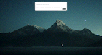

# Website Bookmarker

Save websites in local storage to read later

## Description

This was a code along project from [Scotch](https://scotch.io) that I completed back in April of 2017 that I found floating around my [CodePen](https://codepen.io/https://codepen.io/ritabradley_dev). It allows you to take a URL and save it in local storage. This way, you can access your list of websites everytime you come back to your bookmark page. If the site has an image associated with it, then it'll display that also!

It was coded with Bootstrap and vanilla JavaScript, but I'm hoping to remake this in React.js with Tailwind CSS for styling.

## How to use this app

1. Open the app in your browser.
2. Type/paste in the URL you want to save. (MUST INCLUDE http:// or https://)
3. Click the "Add +" button at the bottom of the box
4. Voila! Your site is saved. Close the browser and come back to it later and your saves will still be there. (Unless you clear your cache).

## See it in action

